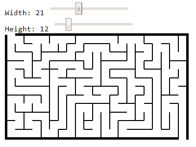
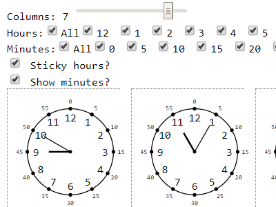

# Printies

## License
Will figure it our later.

## Disclaimer

What is public is public. There are some pieces of Python, JavaScript and other stuff, so proceed with caution.

## My goals

The goal of this project is to help parents keep their children busy with assignments that can be printed.

### Try it

Here is a playground: http://aws-website-displaying-7i6t6.s3-website-us-east-1.amazonaws.com/

### How to install 

If you are on Windows:
- make sure you have git, nodejs and npm installed
- do `git clone https://github.com/aleksey-bykov/printies.git`
- go to `printies` folder
- run `npm install`
- run `run.bat`

If not, may God help you.

### Reading the code?
- consult with namings: https://github.com/zpdDG4gta8XKpMCd/naming
