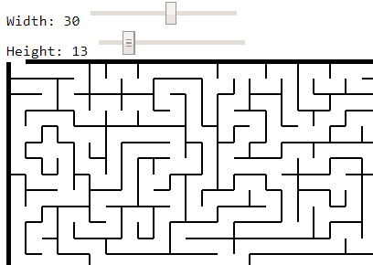
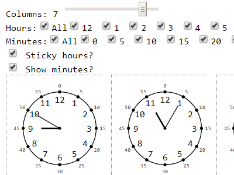

# Printies

The goal of this project is to help parents to keep their children busy with assignments that can be printed.

### How to install 

If you are on Windows:
- make sure you have git installed
- do `git clone https://github.com/aleksey-bykov/printies.git`
- go to `printies` folder
- run `npm install`
- run `run.bat`
